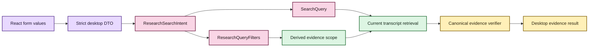

# Typed Research search

EchoFlow has two complementary search surfaces.

The Library search is the quick doorway: enter text and search transcripts plus the human
research layer without needing to understand retrieval controls. The Research workspace
adds an advanced, inspectable query builder for cases where the exact search intent matters.

They do **not** implement separate search engines. Both end in the same Python search and
evidence-navigation authority.

## What the typed intent contains

An advanced Research search can state:

- query text;
- exact-phrase matching or term matching;
- ANY or ALL term operator;
- anonymous speaker-reference filters;
- language filters;
- transcript/document filters;
- relevance or source-timeline ordering;
- result limit;
- lexical, semantic, or hybrid retrieval mode;
- surrounding context-segment count;
- required research tags;
- required research collections;
- required text in attached notes; and
- whether qualifying evidence must have an attached research note.

Those controls are represented in Python as one `ResearchSearchIntent`. The object contains a
normal `SearchQuery`, `ResearchQueryFilters`, `RetrievalMode`, and context count. It rejects
an `evidence_scope` supplied as user intent because evidence scope is derived state, not a
thing the desktop is allowed to author.

Text fallback: React submits form values to a strict desktop DTO. Python constructs the
search intent and research filters, derives any evidence scope from authoritative research
state, retrieves current transcript evidence, and verifies canonical evidence before the
result returns to the desktop.

## The browser does not interpret the query

React is allowed to collect and display values. It does not:

- parse a user query into a different matching policy;
- decide how phrase matching interacts with term operators;
- derive evidence scope from visible notes or labels;
- filter a capped result set after retrieval;
- invent semantic/lexical scores;
- choose a canonical generation;
- query SQLite or DuckDB directly; or
- turn saved searches into shell commands, SQL, or opaque strings.

The backend validates the nested intent again even though browser controls already constrain
some values. The desktop adapter uses `extra="forbid"`, so an unexpected field such as SQL,
a filesystem path, or a derived evidence scope is not silently accepted.

Speaker, language, and transcript filters are currently explicit identifiers. The desktop
does not fabricate authoritative dropdown options by scraping whichever results happen to
be visible. A future convenience picker should come from a backend facet/catalog service.

## Research filters happen before ranking

Tags, collections, note text, and `with_notes` are not browser-side result filters.
`ResearchWorkspaceService` synchronizes the research projection, resolves human-facing
labels to durable IDs, obtains the matching current evidence identities, and passes that
evidence scope into transcript retrieval.

Adding research constraints therefore narrows the candidate evidence **before** lexical or
semantic ranking. The GUI cannot reproduce or weaken that rule.

## Retrieval mode remains backend-qualified

Lexical search is local and deterministic over the current transcript index. Semantic and
hybrid modes use the existing local semantic index and embedding profile. Selecting one of
those modes does not make it magically available: the Python backend still verifies that
semantic state exists, matches the current corpus, and can load the qualified local model.
If not, the operation fails with the normal safe application error rather than falling back
silently to another retrieval mode.

A successful result returns retrieval provenance such as backend IDs, semantic profile, and
hybrid fusion profile. These fields explain how the result set was produced; React does not
calculate them.

## Saved searches store the whole typed question

A saved search is durable intent, not a frozen result list. The persisted object can retain
the same phrase/operator, transcript/speaker/language, research-filter, retrieval, sort,
limit, and context controls used for an immediate search.

Creating a typed saved search converts `ResearchSearchIntent` into the existing durable
`SavedSearchIntent`. Runtime `evidence_scope` is deliberately omitted. Running the question
later re-derives qualifying evidence from whatever current transcript and research state
exists at that time.

Editing a saved search now replaces **display metadata and the complete typed intent in one
authoritative SQLite transaction**. The mutation carries `expected_updated_at`; if another
local surface changed the saved search after it was opened, EchoFlow refuses the stale write
rather than losing the newer edit.

This closes an earlier desktop gap where the backend could persist rich typed intent but the
normal desktop could only create a text query and later rename its display metadata.

## Desktop privacy boundary

The advanced bridge returns evidence text, IDs, hashes needed for evidence identity,
source-relative times, speaker display state, research labels, and retrieval provenance.
It does not return raw canonical or original-recording filesystem paths as part of the typed
search result DTO.

Operational logging for saved-intent replacement records durable object identity, retrieval
mode, context size, and filter counts. It does not log query text, note-text filters, saved
search names/descriptions, or raw media/canonical paths.

## Why keep the quick search?

Most people should not need the advanced controls for ordinary recall. A fast search box is
useful precisely because EchoFlow can choose a safe simple default. The typed Research
surface exists when a researcher needs to say exactly what question was asked and preserve
that question for later replay.

The product rule is therefore:

> **simple by default, inspectable when needed, authoritative in Python either way.**
