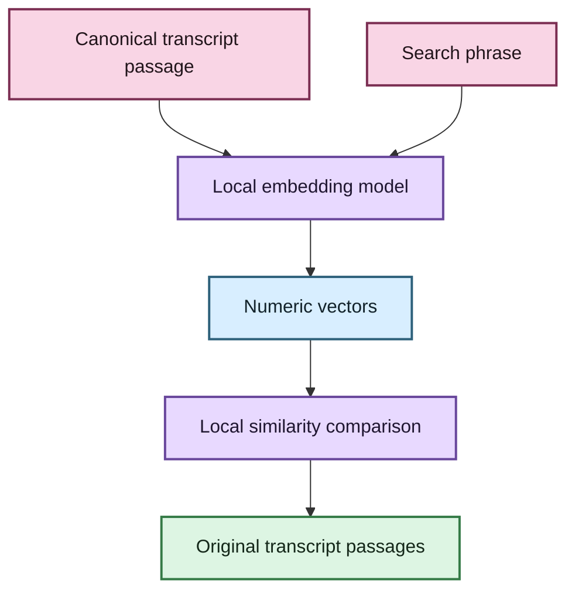
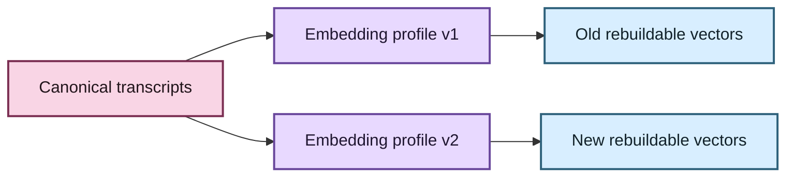

# Semantic search, without the mystery box ✨

EchoFlow can search transcripts in three different ways.

**Lexical search** looks for the words you typed. Search for `rent increase`, and it is
very good at finding passages containing those words.

**Semantic search** looks for passages with a related meaning. Search for:

```text
people struggling to afford housing
```

and it may help find:

```text
I was spending almost seventy percent of my pay on the apartment.
```

The vocabulary differs, but the idea is related.

**Hybrid search** lets exact terminology and conceptual similarity support each other.


Semantic search is optional. Lexical search remains the default and requires no semantic
model runtime.

## What is an embedding?

An embedding is a numeric representation of text used for comparison.

EchoFlow turns a search phrase and small transcript passages into vectors, then compares
those vectors to find passages that sit near the query in the model's learned semantic
space.

The important thing for a user is what an embedding **is not**:

- it is not a replacement transcript;
- it is not a generated summary;
- it is not a hosted database requirement; and
- it is not the only place your transcript exists.

The vector is **derived search data**.



EchoFlow's first qualified semantic profile produces 384-number vectors. Those numbers
are useful because they let the application compare meaning efficiently. You are not
expected to read them. Please do not spend your evening trying. 🧜‍♀️

## 💃 What happens when you turn semantic search on?

EchoFlow builds a private, rebuildable semantic projection from canonical transcripts.

1. Adjacent canonical ASR segments are combined into deterministic search windows.
2. A local embedding model converts each window into a vector.
3. EchoFlow stores those vectors in a private DuckDB semantic index.
4. Search queries are embedded locally with the same profile.
5. The index compares the query vector with eligible local passage vectors.
6. Results point back to the canonical transcript segments that produced them.

Your original recording is not modified. Canonical transcript JSON remains the
user-owned evidence artifact.

## 🔐 Does transcript text leave my computer?

Not during semantic indexing or search in the current implementation.

EchoFlow's semantic provider loads from a **local model snapshot**. Model loading is
configured for local-only resolution with remote model code disabled.

It helps to separate three different network/privacy questions:

### Searching or indexing transcripts

Local. Transcript passages are not sent to a hosted embedding API by this
implementation.

### Obtaining a model

Potentially network-bearing. If you download model weights from a provider such as
Hugging Face, that acquisition step uses the network.

### Using a model already present locally

Offline. EchoFlow accepts the local immutable snapshot path and does not resolve a
repository ID while indexing/searching.

That explicit boundary matters. “Uses a machine-learning model” does not automatically
mean “uploads your transcript to somebody else's server.”

## Why aren't the model weights inside the EchoFlow repository?

Because model weights are large binary dependencies, not application source code.

Vendoring them would make repository size, upgrades, licensing/distribution custody,
caching, and independent model replacement worse.

EchoFlow instead records the qualified profile/revision used to create semantic state.

## Why Multilingual E5 Small?

The first qualified semantic profile is:

```text
intfloat/multilingual-e5-small
```

It gives EchoFlow a conservative combination of:

- multilingual retrieval rather than an English-only search space;
- compact 384-dimensional vectors;
- retrieval-specific query/passage instructions;
- practical local inference compared with much larger embedding families; and
- a mature Sentence Transformers-compatible execution path.

The important product decision is **not** that this particular model is sacred.

The important decision is that one semantic index generation uses one explicit,
reproducible embedding profile.

> **The model is not sacred. The profile is.**

EchoFlow records model identity, immutable revision, dimensions, normalization, pooling,
distance metric, query/passage transforms, embedding schema, and chunking profile.

If the profile changes, the semantic projection is rebuilt instead of silently mixing
incompatible vector spaces.

## 🦝 What can the raccoon rebuild?

Semantic search creates infrastructure, not new source evidence.

| Data | Role | Rebuildable? |
|---|---|---|
| Original recording | source evidence | **No** |
| Canonical transcript JSON | authoritative transcript | **No** |
| Future notes/tags/annotations | user-authored knowledge | **No** |
| Lexical term statistics | search projection | Yes |
| Semantic chunks | derived retrieval windows | Yes |
| Embedding vectors | derived search projection | Yes |

If the semantic database disappears, EchoFlow should be able to rebuild it from
canonical transcripts.

If a future annotation disappears, that is data loss.

Those are intentionally different custody classes.

## Why are transcript passages grouped into chunks?

ASR segments are evidence coordinates, but some are tiny:

```text
Yeah.
```

or:

```text
And then we moved.
```

Embedding each tiny segment independently can discard useful context.

EchoFlow therefore combines adjacent canonical segments into deterministic retrieval
windows. Those chunks carry the IDs/timestamps of their source segments and can be
recreated later.

EchoFlow does not split one canonical ASR segment into invented evidence coordinates
merely to hit a preferred chunk size.

## What does hybrid search actually combine?

BM25 lexical scores and semantic similarity scores are different mathematical things.
EchoFlow does not pretend they share one universal “relevance percentage.”

Hybrid mode instead combines **rank positions** with reciprocal rank fusion (RRF).

That makes the composition simple, inspectable, and local.

The deeper ranking contract is documented in
**[architecture/corpus-search.md](architecture/corpus-search.md)**.

## Using semantic search

Lexical search works without semantic support:

```bash
uv run echoflow library rebuild
uv run echoflow library search "housing insecurity"
```

The current semantic foundation expects a compatible Sentence Transformers runtime and
a local immutable Multilingual E5 Small snapshot.

Build semantic state:

```bash
uv run echoflow library embeddings build \
  /path/to/models--intfloat--multilingual-e5-small/snapshots/<revision> \
  --revision <revision>
```

Inspect the exact profile EchoFlow indexed:

```bash
uv run echoflow library embeddings
uv run echoflow library embeddings --json
```

Search by conceptual similarity:

```bash
uv run echoflow library search \
  "people struggling to make rent" \
  --mode semantic
```

Or combine lexical and semantic retrieval:

```bash
uv run echoflow library search \
  "people struggling to make rent" \
  --mode hybrid
```

## Why is semantic setup still an advanced path?

The locked project dependency graph does not yet include Sentence Transformers.

That means the current semantic tranche proves the architecture and local retrieval
contract without pretending the optional dependency/model acquisition story is already a
qualified normal install.

A later tranche can add:

- an audited/locked semantic dependency extra;
- managed acquisition of the qualified embedding snapshot;
- disk/resource admission;
- private model-cache placement; and
- clean-wheel/platform qualification.

Lexical search stays available regardless.

## Advanced provider interoperability

The retrieval core is provider-agnostic through `EmbeddingProvider` and
`EmbeddingProfile` contracts.

That means another local provider can be implemented without changing canonical
transcripts, chunk custody, semantic storage, hybrid ranking, or public search results.

EchoFlow does **not** currently expose “paste any Hugging Face repository ID and pray”
as ordinary CLI configuration.

Different embedding models may disagree about dimensions, normalization, pooling,
query/passage instructions, and distance semantics. Treating them as drop-in equivalents
would make reproducibility worse.

Future interoperability should therefore be **qualified interoperability**: another
provider declares and validates its complete profile, then builds a fresh semantic
generation.

## What if a better model appears later?

Nothing about canonical transcript evidence has to migrate.



Vectors are derived state. Rebuild them. Keep the evidence.

## 💃 What if I never turn semantic search on?

Then EchoFlow continues to use lexical search.

Your transcripts remain canonical. BM25 remains local. Nothing sulks.

Semantic retrieval is an enhancement, not a tax every user must pay.

For exact implementation details, stale-state detection, vector storage, provider
validation, and RRF provenance, descend into
**[Evidence-first corpus search](architecture/corpus-search.md)**.