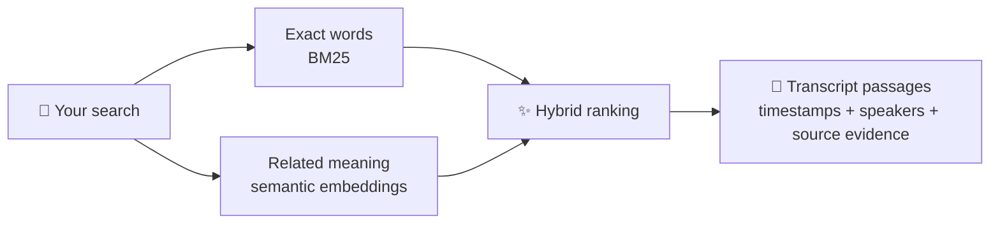
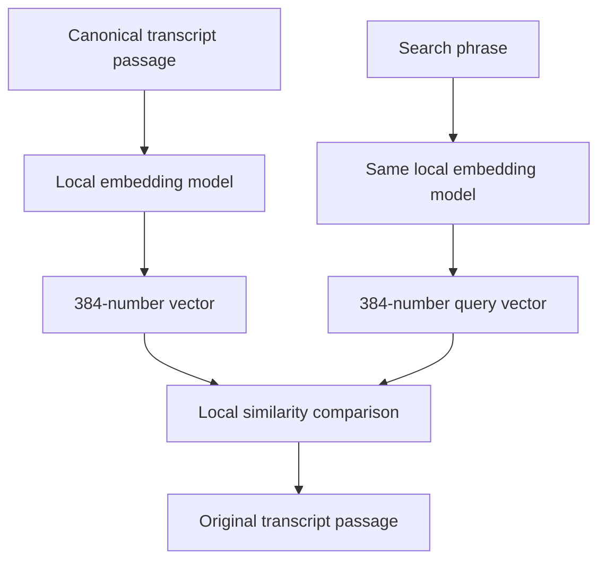
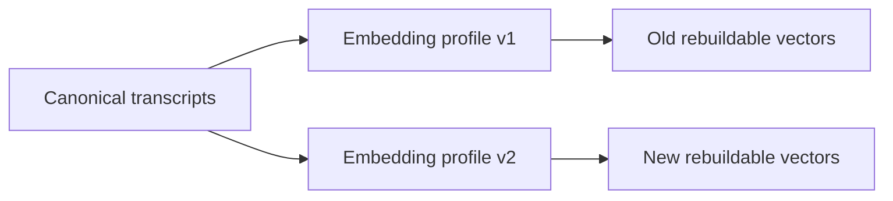

# ✨ Semantic search, without the mystery box

EchoFlow can search transcripts in two different ways.

**Lexical search** looks for the words you typed. If you search for `rent increase`, it
is very good at finding `rent increase`.

**Semantic search** looks for passages with a similar meaning. If you search for
`people struggling to afford housing`, it can help find a passage such as:

> I was spending almost seventy percent of my pay on the apartment.

The passage did not use the words *struggling to afford housing*, but it expresses a
closely related idea.

EchoFlow can also use **hybrid search**, which combines lexical and semantic results so
exact terminology and conceptual similarity can support each other.



Semantic search is optional. Lexical search remains the default and does not require a
semantic model.

## What is an embedding?

An embedding is a numeric representation of text used for comparison. EchoFlow turns a
search phrase and small transcript passages into vectors, then compares those vectors to
find nearby meanings.

The vector is **derived search data**. It is not a replacement transcript, and it is not
a generated summary of what somebody said.



The result EchoFlow shows is still the source passage, with transcript identity,
segment coordinates, timestamps, language/speaker evidence, and retrieval provenance.

## 💃 What happens when you turn semantic search on?

EchoFlow creates a private, rebuildable semantic search index from your canonical
transcripts.

1. Adjacent transcript segments are combined into deterministic search windows.
2. A local embedding model converts each window into a numeric vector.
3. EchoFlow stores those vectors in a private DuckDB projection.
4. Searches are embedded locally and compared with the stored vectors.
5. Results point back to the canonical transcript segments that produced them.

Your original recording is not modified. Your canonical transcript remains the
user-owned evidence artifact.


## 🔐 Does transcript text leave my computer?

Not during semantic indexing or search.

EchoFlow's semantic provider is loaded from a **local model snapshot**. Model loading is
configured with local-only resolution and remote model code disabled. Transcript
passages are embedded on the machine running EchoFlow.

There are three different network/privacy questions worth separating:

- **Searching/indexing transcripts:** local. Transcript text is not sent to a hosted
  embedding API by this implementation.
- **Obtaining a model:** may require a network connection if you choose to download a
  model from somewhere such as Hugging Face. That acquisition step is separate from
  transcript processing.
- **Using a model already present locally:** offline. EchoFlow accepts the local immutable
  snapshot path and does not resolve a repository ID while indexing/searching.

EchoFlow does not currently bundle model weights in this repository. Shipping hundreds
of megabytes of model data inside the source tree would make repository custody,
updates, licensing, and installations worse.

## Why Multilingual E5 Small?

EchoFlow's first qualified semantic profile is
`intfloat/multilingual-e5-small`.

It is used as a conservative local default because the profile gives EchoFlow a useful
combination of:

- multilingual retrieval rather than an English-only search space;
- compact 384-dimensional vectors;
- a retrieval-specific query/passage contract;
- practical local inference compared with larger embedding families;
- a mature Sentence Transformers-compatible execution path.

The important product decision is not that this model is sacred. It is that **one
semantic index generation uses one explicit, reproducible embedding profile**.

EchoFlow records the model ID, immutable revision, dimensions, normalization, pooling
provenance, distance metric, query/passage transforms, and chunking profile. If the
profile changes, the derived semantic index is rebuilt instead of silently mixing two
vector spaces.

## 🦝 What lives under the floorboards?

Semantic search creates infrastructure, not new evidence.

| Data | Role | Can EchoFlow rebuild it? |
|---|---|---|
| Original recording | source evidence | no |
| Canonical transcript JSON | authoritative transcript | no |
| Lexical term statistics | search projection | yes |
| Semantic chunks | derived retrieval windows | yes |
| Embedding vectors | derived search projection | yes |
| Future notes/tags/annotations | user-authored state | **must not be treated as disposable** |

If the semantic database disappears, EchoFlow should be able to rebuild it from the
canonical transcripts. If an annotation disappears, that is data loss. Those are
intentionally different custody classes.

## Using semantic search

Lexical search works without semantic support:

```bash
uv run echoflow library rebuild
uv run echoflow library search "housing insecurity"
```

The current semantic foundation expects a compatible Sentence Transformers runtime and
a local immutable Multilingual E5 Small snapshot. Build the semantic projection with:

```bash
uv run echoflow library embeddings build \
  /path/to/models--intfloat--multilingual-e5-small/snapshots/<revision> \
  --revision <revision>
```

Inspect the exact profile EchoFlow indexed:

```bash
uv run echoflow library embeddings
uv run echoflow library embeddings --json
```

Search by conceptual similarity:

```bash
uv run echoflow library search \
  "people struggling to make rent" \
  --mode semantic
```

Or combine semantic and lexical retrieval:

```bash
uv run echoflow library search \
  "people struggling to make rent" \
  --mode hybrid
```

## Advanced model interoperability

EchoFlow's retrieval core is deliberately **provider-agnostic**. Search depends on an
`EmbeddingProvider` contract with separate query and passage embedding operations, plus
an immutable `EmbeddingProfile` describing the vector space.

That means another local provider can be implemented without changing canonical
transcripts, chunk custody, DuckDB semantic storage, hybrid ranking, or the public search
response.

EchoFlow does **not** currently expose “paste any Hugging Face repository ID” as a normal
CLI option. Different embedding models may disagree about dimensions, normalization,
pooling, query instructions, passage instructions, and distance semantics. Treating
those models as drop-in equivalents would make reproducibility worse.

The intended advanced extension is therefore **qualified interoperability**:

```text
EmbeddingProvider
├── Multilingual E5 Small (current qualified default)
├── future larger/local profiles
├── future alternate Sentence Transformers profiles
└── custom provider adapters that declare a complete EmbeddingProfile
```

A future advanced CLI/provider registry can expose additional profiles once EchoFlow can
validate their complete retrieval contract rather than accepting an arbitrary model name
and hoping its mathematics happen to match.

## What if a better model appears later?

Nothing about the canonical transcript has to migrate.



Because vectors are derived state, EchoFlow can discard the old semantic projection and
rebuild it with a new qualified profile. Existing transcript evidence remains unchanged.

For implementation details, provenance fields, RRF ranking, and stale-index detection,
see [`architecture/corpus-search.md`](architecture/corpus-search.md).
