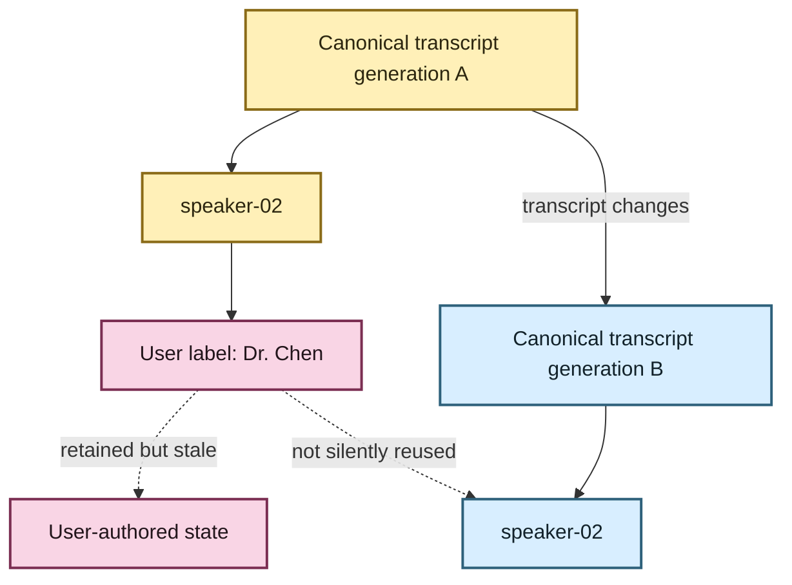

# Give the anonymous speakers names 👥✨

Diarization gives EchoFlow useful but intentionally anonymous evidence:

```text
speaker-01
speaker-02
speaker-03
```

That is excellent for provenance and terrible for remembering which person was Dr. Chen.

EchoFlow therefore keeps **two different facts** instead of pretending they are the same thing:

- `speaker-02` is machine-produced diarization evidence;
- `Dr. Chen` is a name **you** assigned to that anonymous speaker in this transcript generation.

The friendly label never rewrites the evidence underneath it.

```mermaid
flowchart LR
    D[Anonymous diarization evidence] --> R[speaker-02]
    R --> C[Canonical transcript coordinates]
    R --> U[User-authored display label]
    U --> V[Dr. Chen (speaker-02)]

    classDef evidence fill:#FFF0B8,stroke:#8A6B18,stroke-width:2px,color:#2C260F
    classDef user fill:#F9D5E5,stroke:#7B2E52,stroke-width:2px,color:#22151B
    classDef view fill:#DDF5E3,stroke:#347A46,stroke-width:2px,color:#142719

    class D,R,C evidence
    class U user
    class V view
```

🦝 **The raccoon may rebuild the search index. The raccoon may not eat your names.**

## Naming a speaker

First make sure the transcript is present in the local library, then inspect its anonymous speaker refs:

```bash
echoflow library speakers list TRANSCRIPT_ID
```

Assign a human-readable display label:

```bash
echoflow library speakers name TRANSCRIPT_ID speaker-02 "Dr. Chen"
```

EchoFlow will continue to retain `speaker-02` as the evidence reference and can present the friendly form as:

```text
Dr. Chen (speaker-02)
```

If you change your mind:

```bash
echoflow library speakers forget-name TRANSCRIPT_ID speaker-02
```

Every command also supports `--json` for machine-readable output.

## Why not just replace `speaker-02` with the name?

Because those statements come from different authorities.

Diarization says:

> this voice cluster received the recording-scoped anonymous reference `speaker-02`.

You say:

> I know this person is Dr. Chen, so show me that name while I work.

If EchoFlow overwrote one with the other, it would destroy the distinction between **derived evidence** and **human knowledge**. That distinction matters for reproducibility, correction, auditing, and future annotations.

## What if the transcript changes?

Speaker numbering is meaningful only inside the canonical transcript generation that produced it.

A re-transcription could change where speaker boundaries fall. It could even make tomorrow's `speaker-02` represent somebody different from today's `speaker-02`.

So a display label is bound to:

```text
transcript ID
+ exact canonical transcript SHA-256
+ anonymous speaker ref
```

If the canonical transcript changes, EchoFlow **keeps the old user-authored label** but refuses to silently apply it to the new generation.



That is slightly fussy on purpose. EchoFlow would rather ask you to confirm a name than confidently attach Dr. Chen to the wrong human.

## What about speaker handoffs inside one transcript segment?

Word-level timing matters here.

A mixed ASR segment may have no single segment-level `speaker_ref` because the speaker changes halfway through. Its individual aligned words can still carry `speaker-01` and `speaker-02` evidence.

The speaker-label service inspects **both segment-level and aligned-word speaker evidence**, so those speakers remain available to name even when the enclosing sentence cannot honestly be assigned to one person.

💃 Finer evidence, less lying. A useful trade.

## Where are these labels stored?

Speaker names are **private user-authored state**, not rebuildable search state.

They live under EchoFlow's private application state, separate from:

- the canonical transcript;
- the lexical DuckDB index;
- semantic chunks and vectors; and
- checkpoint/recovery machinery.

Writes use EchoFlow's existing atomic private-file boundary.

This means rebuilding lexical or semantic search must not erase the names you assigned.

## What this does not do

Speaker display labels are not biometric identification. EchoFlow does not infer that `speaker-01` in two different recordings is the same person, and it does not search for somebody's identity from their voice.

This feature also does not solve simultaneous speech. Word-level diarization can preserve ambiguity honestly, but source separation remains a later and materially heavier capability.

For the underlying diarization evidence model, security gate, and overlap rules, see **[Anonymous speaker diarization](architecture/diarization.md)**.
