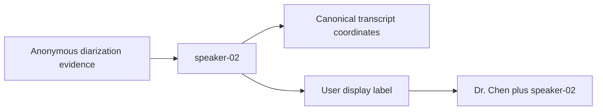
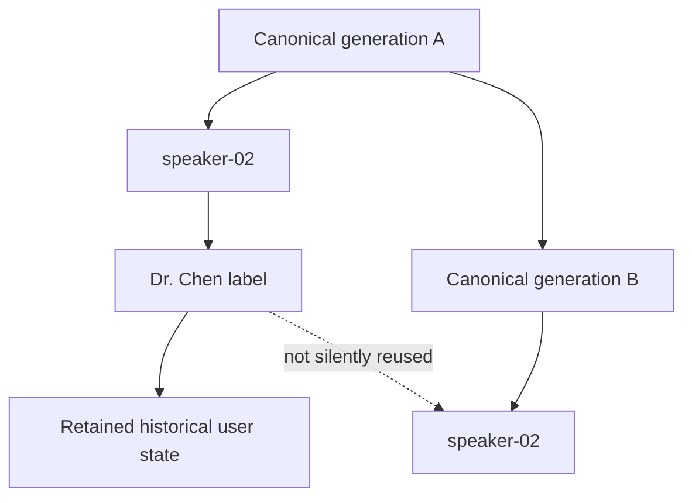
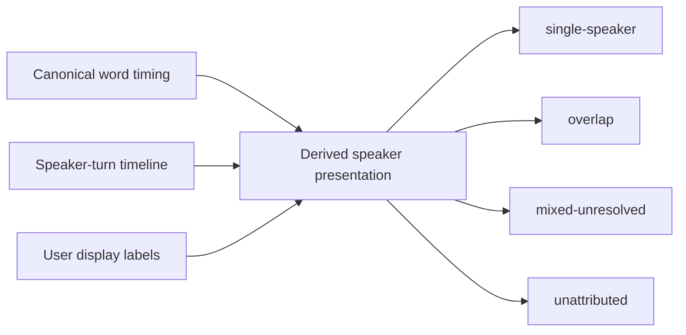

# Give the anonymous speakers names 👥✨

Diarization gives EchoFlow useful but intentionally anonymous evidence:

```text
speaker-01
speaker-02
speaker-03
```

That is excellent for provenance and terrible for remembering which person was Dr. Chen.

EchoFlow therefore keeps **two different facts** instead of pretending they are the same:

- `speaker-02` is machine-produced diarization evidence;
- `Dr. Chen` is a name **you** assigned to that anonymous speaker in this transcript
  generation.

The friendly label never rewrites the evidence underneath it.



Text fallback: the anonymous speaker ref remains evidence; the human name is separate
user-authored presentation state bound to that exact transcript generation.

🦝 **The raccoon may rebuild the search index. The raccoon may not eat your names.**

## Naming a speaker

First make sure the transcript is present in the local library, then inspect its anonymous
speaker refs:

```bash
echoflow library speakers list TRANSCRIPT_ID
```

Assign a human-readable display label:

```bash
echoflow library speakers name TRANSCRIPT_ID speaker-02 "Dr. Chen"
```

EchoFlow keeps `speaker-02` as the evidence reference and can present:

```text
Dr. Chen (speaker-02)
```

If you change your mind:

```bash
echoflow library speakers forget-name TRANSCRIPT_ID speaker-02
```

Every command also supports `--json` for machine-readable output.

## Why not replace `speaker-02` with the name?

Because those statements come from different authorities.

Diarization says:

> this voice cluster received the recording-scoped anonymous reference `speaker-02`.

You say:

> I know this person is Dr. Chen, so show me that name while I work.

Overwriting one with the other would destroy the distinction between machine-produced
evidence and human knowledge. That distinction matters for reproducibility, correction,
auditing, search, and durable research notes.

## What if the transcript changes?

Speaker numbering is meaningful only inside the canonical transcript generation that
produced it.

A re-transcription could change speaker boundaries. Tomorrow's `speaker-02` could even
represent somebody different from today's `speaker-02`.

A display label is therefore bound to:

```text
transcript ID
+ exact canonical transcript SHA-256
+ anonymous speaker ref
```

If the canonical transcript changes, EchoFlow **keeps the old user-authored label** but
refuses to silently apply it to the new generation.



That is slightly fussy on purpose. EchoFlow would rather require an explicit human action
than confidently attach Dr. Chen to the wrong person.

## What about speaker handoffs inside one transcript segment?

Word-level timing matters here.

A mixed ASR segment may have no single segment-level `speaker_ref` because the speaker
changes halfway through. Its individual aligned words can still carry `speaker-01` and
`speaker-02` evidence.

The speaker-label service inspects **both segment-level and aligned-word speaker evidence**,
so those speakers remain available to name even when the enclosing sentence cannot
honestly be assigned to one person.

## Reading handoffs and overlap without flattening them

The derived speaker transcript view combines canonical word timing with the preserved
speaker-turn timeline:

```bash
echoflow library speakers transcript TRANSCRIPT_ID
```

A clean handoff can become two readable spans:

```text
00:00:04.100  Interviewer (speaker-01)       single-speaker  What happened next?
00:00:05.900  Dr. Chen (speaker-02)          single-speaker  We moved the samples.
```

If two diarized speakers are simultaneously active over the same aligned word interval,
EchoFlow does not choose a winner:

```text
00:00:12.200  Interviewer (speaker-01)
              + Dr. Chen (speaker-02)         overlap         Sorry…
```

If a coarse segment contains more than one speaker but lacks word timing precise enough
to assign its text, the view says `mixed-unresolved` rather than pretending the whole
sentence belongs to either person.



This view is **derived presentation**, not a new canonical transcript. Numeric
source-relative seconds and original anonymous refs remain visible in JSON, along with
the canonical transcript SHA-256 that produced the view.

One conservative rule matters: if a canonical aligned word is unattributed, presentation
will not promote it to one named speaker merely because a diarization turn overlaps.
Presentation may expose additional multi-speaker overlap, but it does not manufacture a
stronger single-speaker claim than canonical evidence supports.

## Do the names show up when I search too?

Yes. Ordinary transcript-library search consumes the same current display-label state.

If you assigned:

```text
speaker-02 → Dr. Chen
```

then a human search result can show:

```text
Dr. Chen (speaker-02)
```

Machine-readable output keeps `speaker-02` in `speaker_refs` and exposes the friendly
label separately. Ranking and speaker filters still operate on anonymous evidence refs.

The navigation layer resolves names only for the exact canonical generation behind the
result and batches label lookup per generation.

See **[From search result to the exact evidence](evidence-navigation.md)** for
highlighting, context, source seek behavior, and the evidence coordinate reused by notes.

## Where are these labels stored?

Speaker names are **private user-authored state**, not rebuildable search state.

They currently live under EchoFlow's private application state using the existing atomic
private-file boundary, separate from:

- canonical transcript evidence;
- the lexical DuckDB index;
- semantic chunks and vectors;
- SQLite research notes/tags/collections; and
- checkpoint/recovery machinery.

This means rebuilding lexical, semantic, or research query projections must not erase the
names you assigned.

A later consolidation into the transactional research-state store is possible if it earns
its value, but presentation code should continue to use the application service rather
than depend on the physical adapter.

## What this does not do

Speaker display labels are not biometric identification. EchoFlow does not infer that
`speaker-01` in two recordings is the same person, and it does not search for somebody's
identity from their voice.

Overlap-aware presentation also does not perform source separation. It represents
simultaneous speaker evidence using the timeline EchoFlow already has. Separating
mixed speech into estimated sources remains later and materially heavier, with its own
compute, model-custody, and provenance requirements.

For the underlying diarization evidence model, security gate, and overlap rules, see
**[Anonymous speaker diarization](architecture/diarization.md)**.
