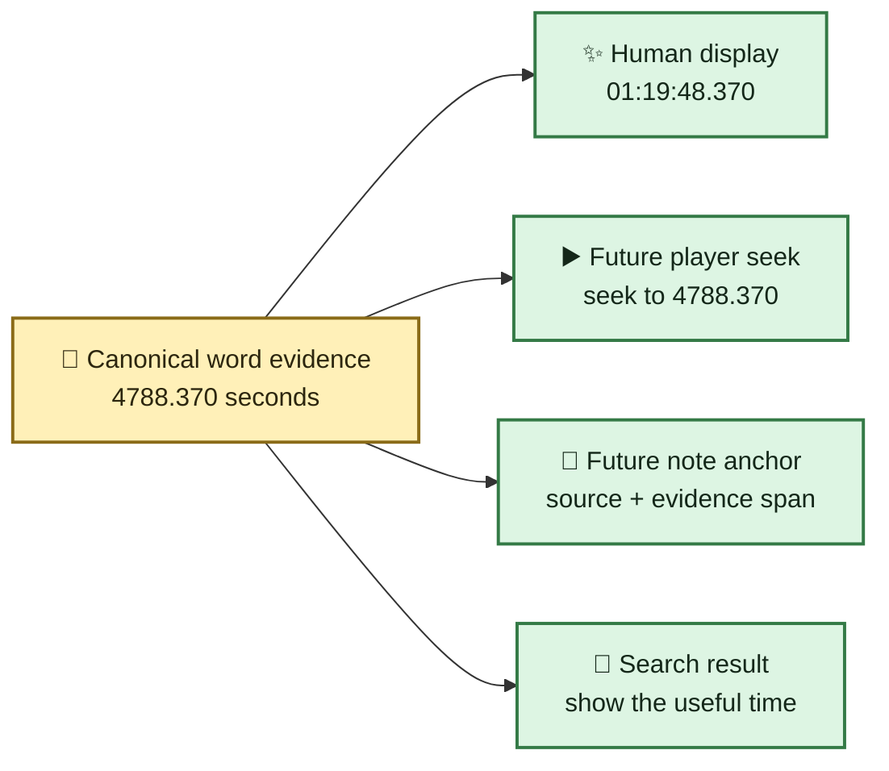
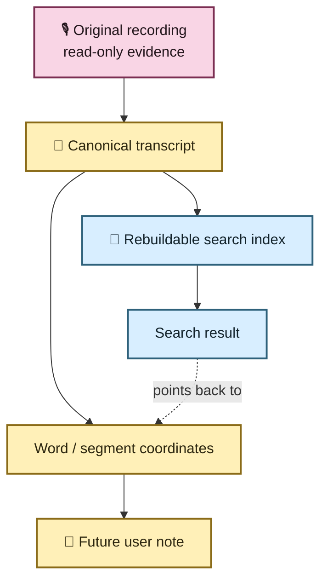
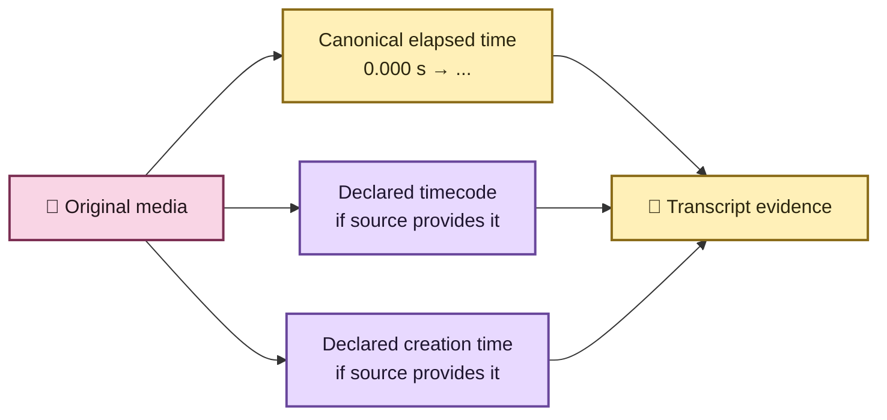

# 🕰️ Transcript time without calculator gymnastics

A transcript is much more useful when “where did they say that?” has an answer that a
human can actually use.

EchoFlow therefore keeps **one durable numeric timeline** and can present it as a familiar
clock-style coordinate.

If a passage begins `4788.37` seconds into a recording, you should not have to divide by
60 twice in your head.

EchoFlow can present that as:

```text
01:19:48.370
```

That means **1 hour, 19 minutes, 48 seconds, and 370 milliseconds after the beginning of
the selected recording audio**.

🦝 The raccoon has been relieved of manual base-60 arithmetic duties.

## What did word timestamps add?

Before word timing, a transcript segment might say:

```text
01:19:40.000 → 01:20:02.000
"We eventually realized the housing cost was the real problem."
```

That tells you where the sentence-sized segment lives, but not where a particular phrase
inside it begins.

With native word timing, the canonical transcript can retain finer evidence:

```text
"housing"  → 4788.370 s
"cost"     → 4788.910 s
"problem"  → 4791.125 s
```

The pretty display is derived from those numeric coordinates:

```text
"housing"  → 01:19:48.370
"cost"     → 01:19:48.910
"problem"  → 01:19:51.125
```

The numbers are the anchor. The clock-style strings are the label on the drawer.



## Can I click a word and jump to that exact place in the recording?

**The evidence coordinate needed for that now exists.**

A future local player can take a word's `start_seconds` and seek the original recording
to that point. Search results already carry source-relative start/end seconds, and the
human CLI view now renders them as `HH:MM:SS.mmm` instead of asking you to interpret a
large decimal number.

EchoFlow does **not yet ship the graphical media-player click handler**. The important
part is that the UI will not need to guess where a phrase lives when that layer arrives.
It can consume canonical evidence that already has the coordinate.

## What about notes and annotations? 📝

Notes are planned as **durable user-authored knowledge**, not search-index metadata.
There is not yet a finished notes editor or annotation store.

When that feature arrives, a note should anchor to durable evidence, conceptually:

```text
source SHA-256:   <recording fingerprint>
start:            4788.370 s
end:              4791.125 s
canonical span:   the relevant segment/word evidence
note:             "Participant connects housing cost to the decision to leave."
```

It should **not** anchor only to:

```text
"01:19:48.370"
```

Why? Because `01:19:48.370` is presentation. We may later offer a different visual
format, but a researcher's sticky note should not fall off the transcript because
someone changed the clock typography.

It also should not anchor only to a semantic-search chunk ID. Search chunks and indexes
are rebuildable. Notes are not.



If the librarian rebuilds the index, the note remains attached to the evidence. This is
one of EchoFlow's custody rules, not a decorative preference.

## Do internal work chunks reset the clock?

No.

EchoFlow currently uses application-owned work windows that are **10 minutes by default**
(`600` seconds), not hour-long user-visible transcript sections. Those windows exist so
long recordings can be processed and checkpointed safely.

They are an implementation detail.

When a work window starts at `4200` seconds and faster-whisper reports a word at `588.37`
seconds inside that work window, assembly rebases it onto the source timeline:

```text
4200.000 + 588.370 = 4788.370 seconds
                       ↓
                 01:19:48.370
```

The published coordinate never resets to zero because EchoFlow happened to create a new
work file.

💃 Internal segmentation may change costumes. The source timeline does not.

## What if the camera or media file already has a timecode?

That is a **different clock**.

Some MOV/MP4/camera files may declare metadata such as:

```text
timecode:      10:00:00:00
creation_time: 2026-04-05T12:34:56Z
```

EchoFlow now asks FFprobe for `timecode` and `creation_time` at both container and stream
scope. When present, those declarations are preserved in canonical source provenance,
including where they came from.

EchoFlow does **not** silently decide that a camera tag is true. Devices can have wrong
clocks, copied metadata, conflicting stream tags, or timecode with frame-rate/drop-frame
semantics that require more information before arithmetic is safe.

So the model stays parallel:



**Elapsed time answers:** “where is this inside the selected recording?”

**Declared media metadata answers:** “what other clock information did the source claim
to have?”

Those are useful together. They are dangerous when collapsed into one mystery field
called `timestamp`.

## Why not immediately add 1:19:48 to `10:00:00:00`?

Because SMPTE-style timecode is not just wall-clock `HH:MM:SS` with two extra digits.
Frame rate and drop-frame/non-drop-frame semantics can change the arithmetic.

This tranche deliberately preserves source declarations **without inventing a mapping it
cannot yet qualify**.

For ordinary transcript navigation, no such mapping is necessary. Canonical elapsed time
already gives a local player an exact seek coordinate.

## What you get now

| Need | Current behavior |
|---|---|
| “Where is 4788 seconds?” | rendered as `01:19:48.000` |
| Search result navigation | human elapsed start/end plus numeric seconds in JSON |
| Word-level position | native faster-whisper word start/end retained in canonical evidence |
| Speaker handoff inside one ASR segment | word evidence can carry the handoff without inventing one segment speaker |
| Original `timecode` metadata | preserved when FFprobe reports it, with source scope |
| Original `creation_time` metadata | preserved when FFprobe reports it, with source scope |
| Click word to play source | coordinate is ready; graphical player interaction is still future UI work |
| Durable notes/annotations | architecture is ready for canonical anchors; editor/storage is still future work |
| SMPTE frame arithmetic | intentionally not inferred without qualified frame semantics |

## The small rule underneath all of this

**Store evidence coordinates. Derive pretty clocks. Preserve source claims. Do not
confuse the three.** ✨

For the exact implementation contract, see
**[Media normalization and transcript timeline](architecture/media-and-timeline.md)** and
**[Word-level timestamp alignment](architecture/word-alignment.md)**.
