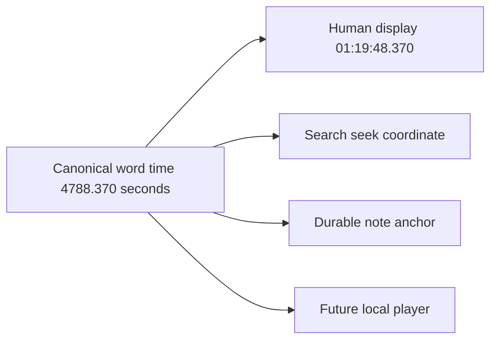
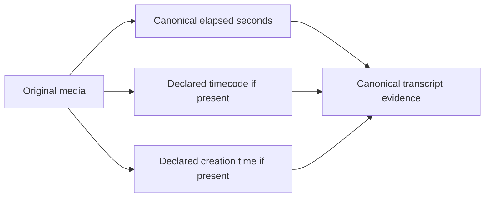

# 🕰️ Transcript time without calculator gymnastics

A transcript is much more useful when “where did they say that?” has an answer a human can
actually use.

EchoFlow keeps **one durable numeric source-relative timeline** and derives familiar
clock-style coordinates from it.

If a passage begins `4788.37` seconds into a recording, EchoFlow can present:

```text
01:19:48.370
```

That means 1 hour, 19 minutes, 48 seconds, and 370 milliseconds after the beginning of
the selected recording audio.

The numeric coordinate is the anchor. The clock string is presentation.

## What did word timestamps add?

Before word timing, a segment might say:

```text
01:19:40.000 → 01:20:02.000
"We eventually realized the housing cost was the real problem."
```

With native word timing, canonical evidence can retain finer positions:

```text
"housing"  → 4788.370 s
"cost"     → 4788.910 s
"problem"  → 4791.125 s
```

and render them as:

```text
"housing"  → 01:19:48.370
"cost"     → 01:19:48.910
"problem"  → 01:19:51.125
```



## Can search find the exact place now?

Yes, when the retrieval evidence justifies that precision.

The library navigation layer reopens the exact canonical transcript, verifies its
SHA-256, and resolves a ranked search result back to canonical segments and aligned words.

For lexical search, matching aligned words can become exact highlighted evidence and the
first matched word becomes the preferred source seek coordinate.

For example:

```text
query: "housing cost"
matched canonical words: housing → cost
seek_seconds: 4788.370
seek_timestamp: 01:19:48.370
```

Semantic-only retrieval is intentionally less precise. An embedding can say “this passage
is related” without identifying one exact matching word. EchoFlow therefore exposes the
verified passage and its start time rather than fabricating a word highlight.

## Can I click a word and jump to the recording?

**The application coordinate needed for that exists.**

A local player can seek the original recording using numeric `seek_seconds`. Search
navigation exposes that coordinate directly, so the planned GUI does not need to guess
from rendered text or reconstruct internal work chunks.

EchoFlow does **not yet ship the graphical media-player interaction**. The missing piece
is presentation, not timeline plumbing.

## What about notes and annotations? 📝

Notes are implemented durable user-authored state.

`EvidenceAnchor` reuses the same canonical/source-relative coordinate system as search
navigation:

```text
document ID
source SHA-256
canonical transcript SHA-256
canonical segment ID(s)
numeric start/end seconds
```

The CLI can add a note to a canonical segment:

```bash
echoflow library notes add JOB_ID segment-000042 \
  --body "Compare this with the 2024 survey."
```

A note should **not** anchor only to:

```text
01:19:48.370
```

because that is presentation. It also should not anchor only to a semantic-search chunk ID
because chunks and indexes are rebuildable.

If an index is rebuilt, the note remains attached to durable evidence. If the canonical
transcript changes, EchoFlow keeps the note but treats its old generation as stale rather
than silently moving the annotation.

The first GUI can turn transcript selection into the same verified anchor instead of
inventing a GUI-only coordinate system.

## Do internal work chunks reset the clock?

No.

EchoFlow currently uses application-owned work windows up to 600 seconds. Those windows
exist so long recordings can be processed and checkpointed safely. They are an
implementation detail.

When a work window starts at `4200` seconds and faster-whisper reports a word at `588.37`
seconds inside that window, assembly rebases it onto the source timeline:

```text
4200.000 + 588.370 = 4788.370 seconds
                       ↓
                 01:19:48.370
```

The published coordinate never resets to zero because EchoFlow created a new work file.

## What if the camera or media file already has a timecode?

That is a **different clock**.

Some MOV/MP4/camera files may declare metadata such as:

```text
timecode:      10:00:00:00
creation_time: 2026-04-05T12:34:56Z
```

EchoFlow asks FFprobe for `timecode` and `creation_time` at both container and stream scope.
When present, those declarations are preserved in canonical source provenance, including
where they came from.

EchoFlow does **not** silently decide that a camera tag is true. Devices can have wrong
clocks, copied metadata, conflicting stream tags, or timecode with frame-rate/drop-frame
semantics that require more information before arithmetic is safe.



**Elapsed time answers:** “where is this inside the selected recording?”

**Declared media metadata answers:** “what other clock information did the source claim
to have?”

Those are useful together. They are dangerous when collapsed into one mystery field
called `timestamp`.

## Why not immediately add 1:19:48 to `10:00:00:00`?

Because SMPTE-style timecode is not just wall-clock `HH:MM:SS` with two extra digits.
Frame rate and drop-frame/non-drop-frame semantics can change the arithmetic.

EchoFlow preserves source declarations **without inventing a mapping it cannot yet
qualify**.

For ordinary transcript navigation, no such mapping is necessary. Canonical elapsed time
already gives a local player a deterministic seek coordinate.

## What you get now

| Need | Current behavior |
|---|---|
| “Where is 4788 seconds?” | rendered as `01:19:48.000` |
| Search result navigation | verified canonical location plus numeric/human seek coordinate |
| Exact lexical word match | highlighted aligned words when canonical timing evidence supports it |
| Semantic-only result | verified passage coordinate without fabricated word precision |
| Neighboring reading context | bounded canonical segment expansion after ranking |
| Word-level position | native faster-whisper word start/end retained in canonical evidence |
| Speaker handoff inside one ASR segment | word evidence can carry the handoff without inventing one segment speaker |
| Original `timecode` metadata | preserved when FFprobe reports it, with source scope |
| Original `creation_time` metadata | preserved when FFprobe reports it, with source scope |
| Durable notes/annotations | verified evidence anchors stored with authoritative user state |
| Click word to play source | seek contract is ready; graphical player interaction is future UI work |
| SMPTE frame arithmetic | intentionally not inferred without qualified frame semantics |

## The small rule underneath all of this

**Store evidence coordinates. Derive pretty clocks. Preserve source claims. Do not confuse
the three.** ✨

For the exact implementation contract, see
**[Media normalization and transcript timeline](architecture/media-and-timeline.md)**,
**[Word-level timestamp alignment](architecture/word-alignment.md)**,
**[Evidence-first corpus search](architecture/corpus-search.md)**, and
**[Your notes should survive the machinery](research-notes.md)**.
