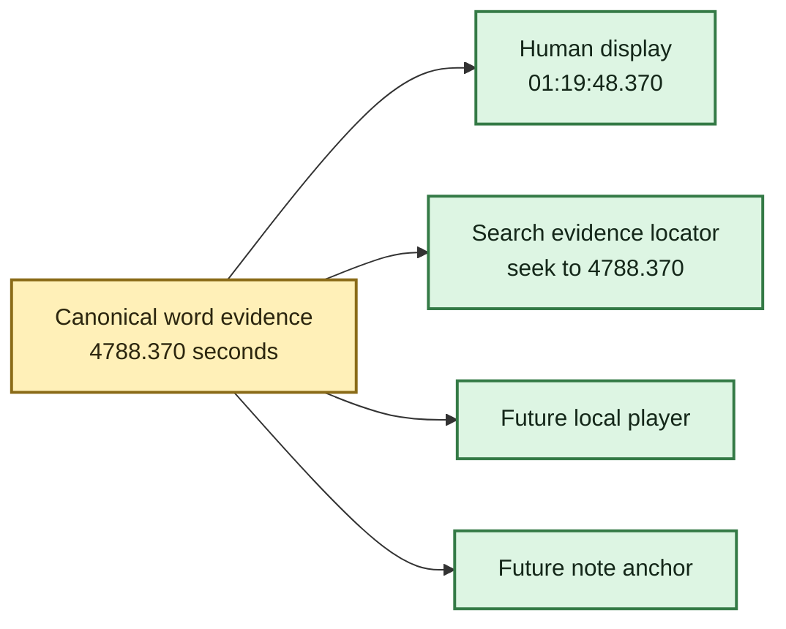
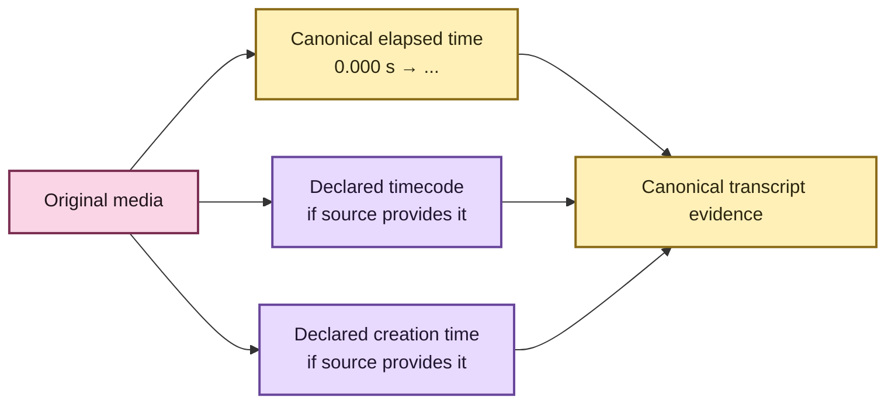

# 🕰️ Transcript time without calculator gymnastics

A transcript is much more useful when “where did they say that?” has an answer that a
human can actually use.

EchoFlow keeps **one durable numeric source-relative timeline** and derives familiar
clock-style coordinates from it.

If a passage begins `4788.37` seconds into a recording, you should not have to divide by
60 twice in your head. EchoFlow can present that as:

```text
01:19:48.370
```

That means **1 hour, 19 minutes, 48 seconds, and 370 milliseconds after the beginning of
the selected recording audio**.

🦝 The raccoon has been relieved of manual base-60 arithmetic duties.

## What did word timestamps add?

Before word timing, a transcript segment might say:

```text
01:19:40.000 → 01:20:02.000
"We eventually realized the housing cost was the real problem."
```

That tells you where the sentence-sized segment lives, but not where a particular phrase
inside it begins.

With native word timing, the canonical transcript can retain finer evidence:

```text
"housing"  → 4788.370 s
"cost"     → 4788.910 s
"problem"  → 4791.125 s
```

The pretty display is derived from those numeric coordinates:

```text
"housing"  → 01:19:48.370
"cost"     → 01:19:48.910
"problem"  → 01:19:51.125
```

The numbers are the anchor. The clock-style strings are the label on the drawer.



## Can search find the exact place now?

Yes, when the retrieval evidence justifies that precision.

The transcript-library navigation layer now reopens the exact canonical transcript,
verifies its SHA-256, and resolves a ranked search result back to canonical segments and
aligned words.

For lexical search, matching aligned words can become the exact highlighted evidence and
the first matched word becomes the preferred source seek coordinate.

For example:

```text
query: "housing cost"
matched canonical words: housing → cost
seek_seconds: 4788.370
seek_timestamp: 01:19:48.370
```

Semantic-only retrieval is intentionally less precise. An embedding can say “this
passage is related to your query” without identifying one exact matching word. EchoFlow
therefore exposes the verified passage and its start time rather than fabricating a word
highlight.

Read **[From search result to the exact evidence](evidence-navigation.md)** for context
expansion, speaker names, and the full search-to-canonical contract.

## Can I click a word and jump to the recording?

**The application coordinate needed for that now exists.**

A local player can seek the original recording using numeric `seek_seconds`. Search
navigation now exposes that coordinate directly, so a future GUI does not need to guess
from rendered text or reconstruct internal work chunks.

EchoFlow does **not yet ship the graphical media-player click handler**. The missing
piece is presentation, not timeline plumbing.

## What about notes and annotations? 📝

Notes are planned as **durable user-authored knowledge**, not search-index metadata.
There is not yet a finished notes editor or annotation store.

The evidence-navigation layer now gives that future feature a concrete anchor to reuse:

```text
source SHA-256
canonical transcript SHA-256
canonical segment ID(s)
word index/indices when available
numeric start/end seconds
```

A note should **not** anchor only to:

```text
"01:19:48.370"
```

because that is presentation. It also should not anchor only to a semantic-search chunk
ID because chunks and indexes are rebuildable.

If the librarian rebuilds the index, the note must remain attached to durable evidence.
If the canonical transcript changes, EchoFlow should retain the note and report that its
old anchor needs review rather than silently moving it.

## Do internal work chunks reset the clock?

No.

EchoFlow currently uses application-owned work windows that are **10 minutes by default**
(`600` seconds). Those windows exist so long recordings can be processed and
checkpointed safely. They are an implementation detail.

When a work window starts at `4200` seconds and faster-whisper reports a word at `588.37`
seconds inside that window, assembly rebases it onto the source timeline:

```text
4200.000 + 588.370 = 4788.370 seconds
                       ↓
                 01:19:48.370
```

The published coordinate never resets to zero because EchoFlow happened to create a new
work file.

💃 Internal segmentation may change costumes. The source timeline does not.

## What if the camera or media file already has a timecode?

That is a **different clock**.

Some MOV/MP4/camera files may declare metadata such as:

```text
timecode:      10:00:00:00
creation_time: 2026-04-05T12:34:56Z
```

EchoFlow asks FFprobe for `timecode` and `creation_time` at both container and stream
scope. When present, those declarations are preserved in canonical source provenance,
including where they came from.

EchoFlow does **not** silently decide that a camera tag is true. Devices can have wrong
clocks, copied metadata, conflicting stream tags, or timecode with frame-rate/drop-frame
semantics that require more information before arithmetic is safe.

So the model stays parallel:



**Elapsed time answers:** “where is this inside the selected recording?”

**Declared media metadata answers:** “what other clock information did the source claim
to have?”

Those are useful together. They are dangerous when collapsed into one mystery field
called `timestamp`.

## Why not immediately add 1:19:48 to `10:00:00:00`?

Because SMPTE-style timecode is not just wall-clock `HH:MM:SS` with two extra digits.
Frame rate and drop-frame/non-drop-frame semantics can change the arithmetic.

EchoFlow preserves source declarations **without inventing a mapping it cannot yet
qualify**.

For ordinary transcript navigation, no such mapping is necessary. Canonical elapsed time
already gives a local player a deterministic seek coordinate.

## What you get now

| Need | Current behavior |
|---|---|
| “Where is 4788 seconds?” | rendered as `01:19:48.000` |
| Search result navigation | verified canonical location plus numeric/human seek coordinate |
| Exact lexical word match | highlighted aligned words when canonical timing evidence supports it |
| Semantic-only result | verified passage coordinate without fabricated word precision |
| Neighboring reading context | bounded canonical segment expansion after ranking |
| Word-level position | native faster-whisper word start/end retained in canonical evidence |
| Speaker handoff inside one ASR segment | word evidence can carry the handoff without inventing one segment speaker |
| Original `timecode` metadata | preserved when FFprobe reports it, with source scope |
| Original `creation_time` metadata | preserved when FFprobe reports it, with source scope |
| Click word to play source | seek contract is ready; graphical player interaction is still future UI work |
| Durable notes/annotations | evidence anchor is ready; editor/storage is still future work |
| SMPTE frame arithmetic | intentionally not inferred without qualified frame semantics |

## The small rule underneath all of this

**Store evidence coordinates. Derive pretty clocks. Preserve source claims. Do not
confuse the three.** ✨

For the exact implementation contract, see
**[Media normalization and transcript timeline](architecture/media-and-timeline.md)**,
**[Word-level timestamp alignment](architecture/word-alignment.md)**, and
**[Evidence-first corpus search](architecture/corpus-search.md)**.
