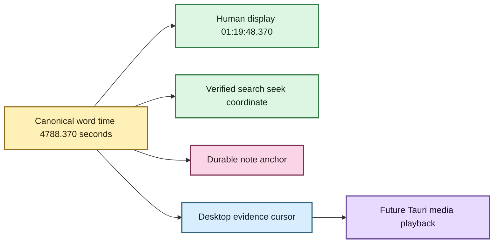
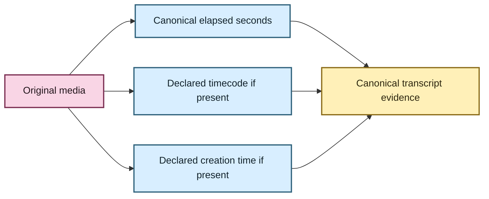

# 🕰️ Transcript time without calculator gymnastics

A transcript is much more useful when “where did they say that?” has an answer a human can
actually use.

EchoFlow keeps **one durable numeric source-relative timeline** and derives familiar
clock-style coordinates from it.

If a passage begins `4788.37` seconds into a recording, EchoFlow can present:

```text
01:19:48.370
```

The numeric coordinate is the anchor. The clock string is presentation.

## What word timestamps add

A segment may span several seconds, while native word timing can preserve finer canonical
positions:

```text
"housing"  → 4788.370 s → 01:19:48.370
"cost"     → 4788.910 s → 01:19:48.910
"problem"  → 4791.125 s → 01:19:51.125
```



Text fallback: one canonical numeric time drives human clock display, verified search
navigation, durable research anchors, and the current desktop evidence cursor. Actual
local media playback remains a separate native capability.

## Can search find the exact place now?

Yes, when the retrieval evidence justifies that precision.

The library navigation layer reopens the exact canonical transcript, verifies its
SHA-256, and resolves a ranked search result back to canonical segments and aligned words.
For lexical search, matching aligned words can become exact highlighted evidence and the
first matched word becomes the preferred source seek coordinate.

Semantic-only retrieval is intentionally less precise. An embedding can say “this passage
is related” without identifying one exact matching word, so EchoFlow exposes the verified
passage and its start time rather than fabricating a word highlight.

## Can I click a word and jump around now?

**The desktop evidence cursor can. The media player cannot yet.**

The Library screen can open a verified Evidence reader. Canonical timed words are
interactive: selecting one moves the reader's evidence cursor to that exact
source-relative coordinate, while **Return to match** restores the backend-selected seek
position.

That is deliberately not the same thing as playing the recording. The current React
surface does not receive an arbitrary source path or open local media itself.

The next native media step is a Tauri-owned playback capability that consumes a verified
coordinate and safe source capability. React should receive playback state and coordinates,
not general filesystem authority.

## What about notes and annotations? 📝

Notes are implemented durable user-authored state. `EvidenceAnchor` reuses the same
canonical/source-relative coordinate system as search navigation:

```text
document ID
source SHA-256
canonical transcript SHA-256
canonical segment ID(s)
numeric start/end seconds
```

The CLI can add a note to a canonical segment:

```bash
echoflow library notes add JOB_ID segment-000042 \
  --body "Compare this with the 2024 survey."
```

The desktop Evidence reader already exposes the verified segment/word coordinate system.
The next **Research workspace UI** should browse those durable anchors and create/edit notes
from verified selections without inventing a UI-only coordinate model.

A note should not anchor only to a rendered clock such as `01:19:48.370`, because that is
presentation. It also should not anchor only to a semantic-search chunk ID because chunks
and indexes are rebuildable.

If an index is rebuilt, the note remains attached to durable evidence. If the canonical
transcript changes, EchoFlow keeps the note but treats its old generation as stale rather
than silently moving the annotation.

## Do internal work chunks reset the clock?

No. EchoFlow uses application-owned work windows so long recordings can be processed and
checkpointed safely. Those windows are implementation detail.

When a work window starts at `4200` seconds and faster-whisper reports a word at `588.37`
seconds inside that window, assembly rebases it onto the source timeline:

```text
4200.000 + 588.370 = 4788.370 seconds
                       ↓
                 01:19:48.370
```

The published coordinate never resets to zero because EchoFlow created a new work file.

## What if the media already declares a timecode?

That is a **different clock**.

Some media may declare `timecode` and `creation_time`. EchoFlow preserves those declarations
with their format/stream origin. It does not silently decide that a device tag is true.
Devices can have wrong clocks, copied metadata, conflicting tags, or SMPTE semantics that
require more information before arithmetic is safe.



**Elapsed time answers:** where is this inside the selected recording?

**Declared media metadata answers:** what other clock information did the source claim to
have?

Those are useful together. They are dangerous when collapsed into one mystery field called
`timestamp`.

## Why not immediately add elapsed time to SMPTE timecode?

Because SMPTE-style timecode can depend on frame rate and drop-frame/non-drop-frame
semantics. EchoFlow preserves source declarations **without inventing a mapping it cannot
yet qualify**.

## What you get now

| Need | Current behavior |
|---|---|
| Human elapsed display | derived from canonical numeric seconds |
| Search result navigation | verified canonical location plus numeric/human seek coordinate |
| Exact lexical word match | highlighted aligned words when canonical timing evidence supports it |
| Semantic-only result | verified passage coordinate without fabricated word precision |
| Neighboring reading context | bounded canonical segment expansion after ranking |
| Desktop word interaction | canonical timed words move the evidence cursor; Return to match restores backend seek |
| Durable notes/annotations | verified evidence anchors stored with authoritative user state |
| Play original audio/video | not yet; Tauri media capability is next |
| SMPTE frame arithmetic | intentionally not inferred without qualified frame semantics |

## The small rule underneath all of this

**Store evidence coordinates. Derive pretty clocks. Preserve source claims. Do not confuse
the three.** ✨

For the exact implementation contract, see
**[Media normalization and transcript timeline](architecture/media-and-timeline.md)**,
**[Word-level timestamp alignment](architecture/word-alignment.md)**,
**[Evidence-first corpus search](architecture/corpus-search.md)**, and
**[Your notes should survive the machinery](research-notes.md)**.
